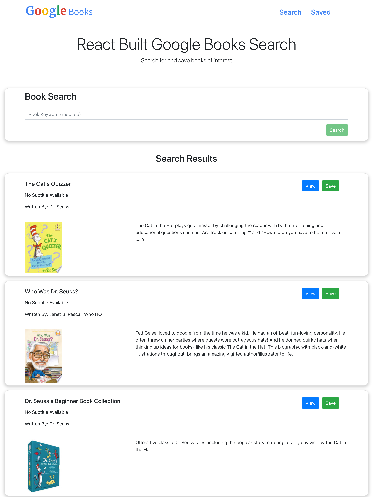
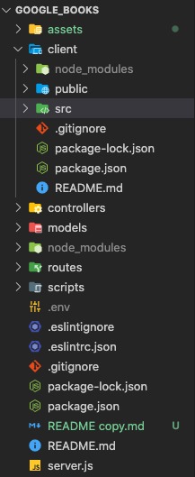

# MERN Stack - Google Books API Search

This is a project built with the MERN stack utilizing the Google Books API to search and save book titles.

## Table of contents

- [Overview](#overview)
- [The challenge](#the-challenge)
- [Screenshot](#screenshot)
- [Links](#links)
- [My process](#my-process)
- [Built with](#built-with)
- [What I learned](#what-i-learned)
- [Continued development](#continued-development)
- [Useful resources](#useful-resources)
- [Author](#author)

## Overview

### The challenge

Users should be able to:

- Search for titles or authors via the Google Books API and render them in the search results. 
- "View" a book, bringing them to the book on Google Books
- "Save" a book, saving it to the Mongo database
- Renders all books saved to the Mongo database in the saved section
- "Delete" a book, removing it from the Mongo database.


### Screenshot



### Links

- GitHub URL: [GitHub URL here](https://github.com/brianlfarmerllc/Google_Books)
- Live Site URL: [Live site URL here](https://gbooks-search-brianlfarmerllc.herokuapp.com/)

## My process

### Built with

- M.E.R.N. Stack
- Mongo DB with Mongoose  
- Express.Js   
- React.Js
- Node.Js
- Semantic HTML5 markup
- CSS3 Styling
- Bootstrap 4
- Axios
- JSX Functionality
- MVC File Structure

### What I learned

This was my first introduction to creating an application using the complete MERN stack. Before this project I did not have a lot of experience using react with a back-end server and this was my first introduction into tying all the parts together. I really tried to focus on creating a clean and readable code base and file structure for the controllers, models, routes, client, and server. 



By creating controllers, I was able to create and reuse the CRUD functions called by the routes.    

```js
module.exports = {
  findAll: function (req, res) {
    db.Book.find(req.query)
      .sort({ date: -1 })
      .then((dbModel) => res.json(dbModel))
      .catch((err) => res.status(422).json(err));
  },
  findById: function (req, res) {
    db.Book.findById(req.params.id)
      .then((dbModel) => res.json(dbModel))
      .catch((err) => res.status(422).json(err));
  },
  create: function (req, res) {
    db.Book.create(req.body)
      .then((dbModel) => res.json(dbModel))
      .catch((err) => res.status(422).json(err));
  },
  update: function (req, res) {
    db.Book.findOneAndUpdate({ _id: req.params.id }, req.body)
      .then((dbModel) => res.json(dbModel))
      .catch((err) => res.status(422).json(err));
  },
  remove: function (req, res) {
    db.Book.findById({ _id: req.params.id })
      .then((dbModel) => dbModel.remove())
      .then((dbModel) => res.json(dbModel))
      .catch((err) => res.status(422).json(err));
  },
};
```

### Continued development

There are numerous frameworks out there but for the time being I intend to focus on learning more about React and how I can further work to build reusable components and manage state in more advanced ways. 

### Useful resources

[React Documentation](https://reactjs.org/docs/getting-started.html/) - I am a big believer in documentation and the React team did and excellent job putting theirs together. Easy to read and digest and super instructive for beginners.

## Author

- Website - [Brian Farmer](https://brianlfarmerllc-biosite.netlify.app/)
- GitHub URL: - [GitHub URL](https://github.com/brianlfarmerllc)

